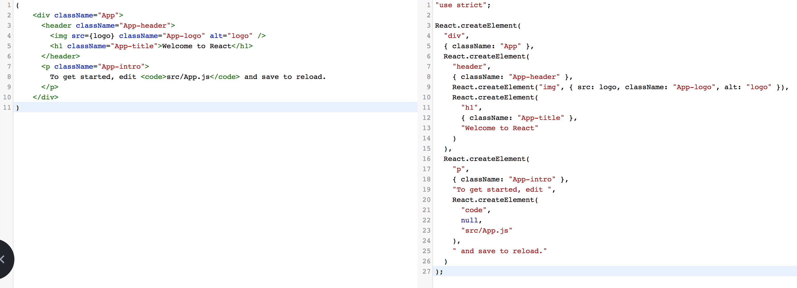

# JSX

- JSX는 JavaScript 와 XML을 합쳐서 만든 JavaScript의 확장 문법이다.
- JavaScript 안에 마크업 코드를 작성할 수 있고, property의 바인딩도 가능하다.
- JSX는 컴파일 되면서 최적화 되므로 빠르다.
- 확장자는 `.js` 를 사용하고 있다.


## JSX를 사용해보자

`create-react-app` 을 사용해서 프로젝트를 생성해 보자

```shell
$ create-react-app sampleproject
```


생성된 폴더에서 `src/App.js` 를 열어보자

```react
import React, { Component } from 'react';
import logo from './logo.svg';
import './App.css';

class App extends Component {
  render() {
    return (
      <div className="App">
        <header className="App-header">
          
          <h1 className="App-title">Welcome to React</h1>
        </header>
        <p className="App-intro">
          To get started, edit <code>src/App.js</code> and save to reload.
        </p>
      </div>
    );
  }
}

export default App;
```


 위에서 부터 살펴보면

```react
import React, { Component } from 'react';
import logo from './logo.svg';
import './App.css';
```

import 문으로 'react' 에서 `React` 와 안에 있는 `Component` 를 불러왔습니다.

마찬가지로 logo.svg와 App.css 파일도 불러왔습니다.


```react
class App extends Component {
  render() {
    return (
      <div className="App">
        <header className="App-header">
          
          <h1 className="App-title">Welcome to React</h1>
        </header>
        <p className="App-intro">
          To get started, edit <code>src/App.js</code> and save to reload.
        </p>
      </div>
    );
  }
}
```

App이라는 컴포넌트를 만들었는데 위에서 불러온 Component를 상속받는 클래스 형태로 생성합니다.

이 클래스에서는 필수적으로 `render` 함수가 필요합니다.

-  `render` : 컴포넌트에 렌더링 될 데이터를 정의함 / JSX 리턴


`render` 에서 반환하고 있는 JSX를 보면 HTML 같지만, **JavaScript** 입니다.

https://babeljs.io 에 가서 변환해보면 오른쪽과 같은 js 코드로 변환이 되는건 확인할 수 있습니다.




XML 형태의 `JSX` 를 `JavaScript` 로 변환해야 하기 때문에 몇가지 규칙을 준수해야 하는데 밑에서 알아봅시다.


## JSX 규칙


#### 태그 닫기

흔히 HTML에서 `input` 태그를 사용할 때 태그를 안닫는 경우가 있는데, 리액트에서는 컴파일에 실패합니다.

```react
class App extends Component {
  render() {
    return (
      <div>
        <input type="text" />
      </div>
    );
  }
}
```

#### Element 감싸기

컴포넌트에서 여러 Element를 렌더링할 때 `container element` 안에 둬야한다.

```react
// 에러
return  (
           <h1> Hello </h1>
           <h2> World </h2>
       );

// 성공
return  (
            <div>
              <h1> Hello </h1>
              <h2> World </h2>
            </div>
        );

// v16.2 부터는 Fragment 사용 가능
return  (
            <Fragment>
              <h1> Hello </h1>
              <h2> World </h2>
            </Fragment>
        );
```


그 이유는 리액트 컴포넌트가 구현되어 있는 `.d.ts`  파일을 참고하자


```typescript
interface ElementClass extends React.Component<any> {
    render(): React.ReactNode;
}

type ReactChild = ReactElement<any> | ReactText;
type ReactNode = ReactChild | ReactFragment | ReactPortal | string | number | boolean | null | undefined;

namespace JSX {
        // tslint:disable-next-line:no-empty-interface
        interface Element extends React.ReactElement<any> { }
        interface ElementClass extends React.Component<any> {
            render(): React.ReactNode;
        }
        interface ElementAttributesProperty { props: {}; }
        interface ElementChildrenAttribute { children: {}; }
}

function createElement<P extends HTMLAttributes<T>, T extends HTMLElement>(
        type: keyof ReactHTML,
        props?: ClassAttributes<T> & P | null,
        ...children: ReactNode[]): DetailedReactHTMLElement<P, T>;
```


#### JavaScript 사용

JSX 내부에 JavaScript 값을 사용해야 할 때는 `{ }` 를 사용한다.

```react
class App extends Component {
  render() {
    const name = "World"
    return (
      <div>
        <h1> Hello { name } </h1>
      </div>
    );
  }
}
```


#### 주석

주석은 `//` 나 `{/* */}` 을 사용한다.


#### 조건문 사용

JSX 내부에서는 `if 문` 을 사용할 수 없습니다. ㅜㅜ

**삼항 연산자( ? : )** 와 **And 연산자(&&)** 를 사용하여 조건문을 사용한다.

```react
// 삼항 연산자
class App extends Component {
  render() {
    const isVisible = true
    return (
      <div>
        {
            isVisible 
                ? (<div> true </div>)
                : (<div> false </div>)
        }
      </div>
    );
  }
}
```

```react

// And 연산자
class App extends Component {
  render() {
    const isVisible = true
    return (
      <div>
        {
            isVisible && (<div> true </div>)
        }
      </div>
    );
  }
}
```

- `삼항 연산자` 는 조건이 true, false 일 때 각각 다른 요소들을 보여줄 때 사용한다.
- `And 연산자` 는 조건이 true 일 때만 보여줄 경우에 사용한다.
- 복잡한 로직의 경우 JSX 밖에서 처리를 하고, JSX 내부에서 해야한다면 **IIFE** 를 사용하자


#### Style 과 CSS Class

JSX 에서 style 과 CSS Class 를 설정하는건 기존에 HTML에서 하던 방식과는 다르다.

```react
class App extends Component {
  render() {
    const style = {
      backgroundColor: 'black',
      color: 'white'
    };

    return (
      <div style={style}>
        Hello, World
      </div>
    );
  }
}
```

- inline으로 style을 넣어주는 경우는 위와 같이 처리한다.
- HTML에서 클래스를 설정할 때 class를 사용했다면 JSX에서는 className을 사용한다.

```react
class App extends Component {
  render() {
    return (
      // class 대신에 className을 사용한다.
      <div className="title">
        Hello, World
      </div>
    );
  }
}
```

위의 JSX 는 아래와 같이 변환되어 class가 설정된다.

```js
React.createElement(
  'div',
  {className: 'sidebar'},
  null
)
```

