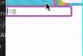
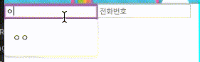
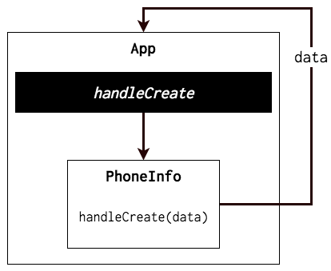
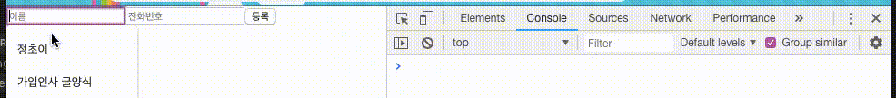
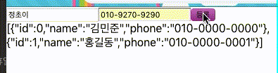
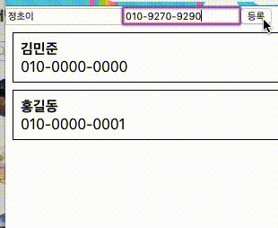

# React 배열 렌더링, 다양한 Input
## Form

### ***기존의 Form과 React의 Form***

기존의 Form

- 사용자가 폼의 상태를 마음대로 바꿀 수 있었음 —> 상태 처리 복잡함, 버그 자주 발생

React의 Form

- 애플리케이션의 상태를 처리하는 것 처럼 폼을 처리할 수 있음.
- 두 종류 : 제어 폼 컴포넌트 & 비제어 폼 컴포넌트
- DOM의 상태를 컴포넌트로 옮길 수 있지만, 복잡한 폼 컴포넌트를 다룰 때는 직접 DOM에 접근해야 함.


### ***비제어 컴포넌트***

- 대부분의 React 컴포넌트가 만들어진 방식인 부모 컴포넌트에서 값을 설정하는 것과 정반대로 만들어짐
- React 컴포넌트가 폼 컴포넌트의 value를 제어하지 않음을 뜻함.
  - HTML 폼에서, `<input/>`에 value가 있으면 `<input/>`은 value 값을 변경할 수 있는데, React는 다르게 동작

- React를 이용할 때에는 `defaultValue`를 이용해 `<input/>`에 기본값 설정함.

```jsx
var MyForm = React.createClass({
    render: function () {
        return <input type = "text" defaultValue="Hello World!"	/>;
    }
})
```

> 부모 컴포넌트가 value를 설정하는 것이 아니라, `<input/>`이 자체적으로 value를 조작한다.
> 비제어 컴포넌트의 value에 접근할 수 없다면 쓸모가 없을 것인데, ref를 `<input/>`에 추가하면 DOMNode를 통해서 value에 접근 가능하다 (ref --> 다음시간!)

- 비제어 컴포넌트는 입력값을 검사하거나 제어할 필요가 없는 기본 폼에 가장 적합하다.


### ***제어 컴포넌트***

- 다른 React 컴포넌트와 같은 방식을 따른다.
  - React 컴포넌트가 폼 컴포넌트의 상태를 제어하며, React 컴포넌트의 상태를 value에 저장한다.
- 폼 컴포넌트를 더 많이 제어하고 싶을 때에는 제어 컴포넌트를 사용한다.
- 제어 컴포넌트는 부모 컴포넌트가 input의 value 값을 설정한다.
  - `<input/>` 의 value를 부모 컴포넌트의 상태에 저장한다는 점이 중요.
- 데이터 흐름 명확해짐, 데이터 흐름 제어 가능, 사용자가 입력한 값으로 컴포넌트의 상태를 변경할 수 있다.

- ex) 입력 문자 제한, 이메일 주소 검증, 입력받은 데이터를 다른 컴포넌트의 value 값으로 사용 가능
  - 입력 글자 수 제한이 걸린 경우, 입력 가능한 남은 글자 수 표시
  - HEX 값으로 입력한 색상 표시
  - 자동완성 표시
  - 입력 값을 이용해 다른 UI 엘리먼트 변경


```jsx
var MyForm = React.createClass({
    getInitialState: function () {
        return {
            helloTo: "hello World!"
        };
    },
    
    handleChange: function (event) {
        this.setState({
            helloTo: event.target.value
            // event.target.value.toUpperCase() 하면 사용자의 입력값을 대문자로 바꿈
            // 이때, 데이터가 입력될 때 깜빡거림이 발생X --> React가 브라우저의 네이티브 change 이벤트를 가로챈것
        });
    },
    
    submitHandler: function (event) {
        event.preventDefault();
        alert(this.state.helloTo);
    },
    
    render: function () {
        return <form onSubmit={this.submitHandler}>
        	<input 
                type="text"
                value={this.state.helloTo}
                onChange={this.handleChange} />
           	<br />
            <button type="submit">Speak</button>
        </form>
    }
})
```

- 데이터 흐름
  - getInitialState가 defaultValue를 설정한다
  - 렌더링하면서 `<input/>` value를 설정한다.
  - `<input/>`의 value가 바뀌면 onChange에 등록한 change 핸들러를 호출한다.
  - change 핸들러가 state를 변경한다.
  - 렌더링하면서 `<input/>` value를 변경한다.

***

## 다양한 Input

### ***textarea***

```jsx
//비제어 컴포넌트
<textarea defaultValue="Hello World" />

//제어 컴포넌트
<textarea
    value={this.state.helloTo}
    onChange={this.handleChange} />
```

- `<input/>` 처럼 value와 defaultValue를 지정할 수 있다.


### ***select***

```jsx
//비제어 컴포넌트
<select defaultValue="B">
	<option value="A">First Option</option>
    <option value="B">Second Option</option>
    <option value="C">Third Option</option>
</select>

//제어 컴포넌트
<select value={this.state.helloTo} onChange={this.handelChange}>
	<option value="A">First Option</option>
    <option value="B">Second Option</option>
    <option value="C">Third Option</option>
</select>
```


React는 다중 선택을 지원해서, value와 defaultValue 값으로 배열을 전달할 수 있다.

```jsx
<select multiple="true" defaultValue={["A","B"]}>
	<option value="A">First Option</option>
    <option value="B">Second Option</option>
    <option value="C">Third Option</option>
</select>
```

- 다중 선택을 이용하면 옵션을 선택했을 때 select 컴포넌트의 값이 변경되지 않는다.
  - 옵션의 selected 속성이 바뀌었을 때 비로소 값이 바뀐다.
  - 옵션 선택 여부를 확인하려면 ref나 syntheticEvent.target을 이용해서 옵션에 접근한다고 한다.


### ***checkbox, radio button***

- HTML `<input/>`의 type에 체크박스나 radio를 입력했을 때와 다르게 동작한다.
- 보통 checkbox나 radio의 value값은 잘 바뀌지 않는다. checked 속성이 바뀔 뿐이다.
- checkbox나 radio 버튼은 checked 속성을 이용하여 제어한다.
- 비제어 checkbox나 radio 버튼은 defaultChecked를 가질 수 있다.

```jsx
//비제어 컴포넌트
var MyForm = React.createClass({
  submitHandler: function (event) {
    event.preventDefault();
    alert(this.refs.checked.getDOMNode().checked);
  }

  render: function () {
    return <form onSubmit={this.submitHandler}>
        <input 
          ref="checked"
          type="checkbox"
          value="A"
          defaultChecked="true" />
        <br />
        <button type="submit">Speak</button>
      </form>;
  }
});

//제어 컴포넌트
var MyForm = React.createClass({
  getInitialState: function () {
    return {
      checked: true
    };
  },
  handleChange: function (event) {
    this.setState({
      checked: event.target.checked
    });
  },
  submitHandler: function (event) {
    event.preventDefault();
    alert(this.state.checked);
  },
  render: function () {
    return <form onSubmit={this.submitHandler}>
        <input 
          type="checkbox"
          value="A"
          checked={this.state.checked}
          onChange={this.handleChange} />
        <br />
        <button type="submit">Speak</button>
      </form>;
  }
});
```

- `<input/>`의 value값은 계속 A이고, 바뀌는 것은 checked 상태 뿐이다.

***

***

## 배열 다루기

React에서는 state 내부의 값을 직접적으로 수정하면 절대 안 된다! (불변성유지)

- push, splice, unshift, pop 과 같은 내장함수는 배열 자체를 직접 수정하는 것이라 사용에 적합하지 않다.
  - javascript에서 데이터를 추가할 때 push()를 사용하니까 `this.state.array.push('value');` 이런 식으로 하면 안 된다.
- 대신, concat, slice, map, filter과 같이 기존의 배열에 기반해 새 배열을 만들어내는 함수를 사용한다.

- 불변성 유지가 중요한 이유
  - 필요한 상황에 따라 리렌더링 되도록 프로젝트를 설계할 수 있고, 나중에 성능 최적화를 하는데 도움을 줄 수 있기 때문.

## 실습 (input + array)

> [여기](https://velopert.com/3634)에 나온 실습 내용을 옮겨놓은 것

```bash
$ create-react-app array-example
```

### ***첫번째 컴포넌트 PhoneForm 만들기***

#### **src/components 라는 디렉토리, PhoneForm.js 파일 만들고 아래 코드 입력**

```jsx
import React, { Component } from 'react';

class PhoneForm extends Component {
  state = {
    name: ''
  }
  handleChange = (e) => {
    this.setState({
      name: e.target.value
    })
  }
  render() {
    return (
      <form>
        <input
          placeholder="이름"
          value={this.state.name}
          onChange={this.handleChange}
        />
        <div>{this.state.name}</div>
      </form>
    );
  }
}

export default PhoneForm;
```

* onChange 이벤트 발생 —> e.target.value 값 통해 이벤트 객체 내의 현재 텍스트 값을 읽어올 수 있다.

> onChange 이벤트 : input의 텍스트 값이 바뀔 때 마다 발생하는 이벤트 

- 나중에 데이터를 등록하면 name 값을 공백으로 초기화해 줄 건데, 그때 input에서도 반영이 되도록 value를 설정해 줬다.
- 하단에는 name값이 잘 바뀌고 있는지 확인할 수 있도록 값을 렌더링


#### **이 컴포넌트를 App에서 보여주기**

```jsx
import React, { Component } from 'react';
import PhoneForm from './components/PhoneForm';


class App extends Component {
  render() {
    return (
      <div>
        <PhoneForm />
      </div>
    );
  }
}

export default App;
```



#### **input값 하나 더 추가하기**

```jsx
// file: src/components/PhoneForm.js
import React, { Component } from 'react';

class PhoneForm extends Component {
  state = {
    name: '',
    phone: ''
  }
  handleChange = (e) => {
    this.setState({
      [e.target.name]: e.target.value
    });
  }
  render() {
    return (
      <form>
        <input
          placeholder="이름"
          value={this.state.name}
          onChange={this.handleChange}
          name="name"
        />
        <input
          placeholder="전화번호"
          value={this.state.phone}
          onChange={this.handleChange}
          name="phone"
        />
        <div>{this.state.name} {this.state.phone}</div>
      </form>
    );
  }
}

export default PhoneForm;
```

- input이 여러개일 때 —> 또 다른 이벤트 핸들러 함수 추가하기 보다는 input의 name 속성을 사용하는 것이 더 낫다.
  - input에 name값을 부여해서 각 input을 구분한다.
  - 조회는 `event.target.name`



#### **부모 컴포넌트에게 정보 전달하기**

- 부모 컴포넌트에서 메소드 만들고, 그 메소드를 자식에게 전달 후 자식 내부에서 호출하는 방식
- 
- App에서 handleCreate라는 메소드를 만들고, 이를 PhoneForm에 전달한다.
- PhoneForm쪽에서 버튼을 만들어서 submit이 발생하면 props로 받은 함수를 호출해
  App에서 파라미터로 받은 값을 사용할 수 있도록 한다.

**App.js 수정하기**

```jsx
import React, { Component } from 'react';
import PhoneForm from './components/PhoneForm';

class App extends Component {
  handleCreate = (data) => {
    console.log(data);
  }
  render() {
    return (
      <div>
        <PhoneForm
          onCreate={this.handleCreate}
        />
      </div>
    );
  }
}

export default App;
```


**PhoneForm.js 에서 버튼, onSubmit 이벤트 설정하기**

```jsx
import React, { Component } from 'react';

class PhoneForm extends Component {
  state = {
    name: '',
    phone: ''
  }
  handleChange = (e) => {
    this.setState({
      [e.target.name]: e.target.value
    })
  }
  handleSubmit = (e) => {
    // 페이지 리로딩 방지
    e.preventDefault();
    // 상태값을 onCreate 를 통하여 부모에게 전달
    this.props.onCreate(this.state);
    // 상태 초기화
    this.setState({
      name: '',
      phone: ''
    })
  }
  render() {
    return (
      <form onSubmit={this.handleSubmit}>
        <input
          placeholder="이름"
          value={this.state.name}
          onChange={this.handleChange}
          name="name"
        />
        <input
          placeholder="전화번호"
          value={this.state.phone}
          onChange={this.handleChange}
          name="phone"
        />
        <button type="submit">등록</button>
      </form>
    );
  }
}

export default PhoneForm;
```

- handleSubmit 함수에서, 맨 위에 `e.preventDefault`함수 호출됨  : 원래 이벤트가 해야하는 작업 방지시킴
  - 원래는 form 에서 submit 발생 —> 페이지 다시 불러옴.
    그러면 우리가 지니고 있는 상태 다 잃어버리기 때문에 이를 통해 방지함
- props로 받은 onCreate 함수 호출하고 상태값 초기화




### ***배열을 이용한 데이터 추가***

```jsx
{
    id: 0,			//데이터 식별용, 데이터 추가할 때 마다 숫자를 1씩 더해줌
    name: '이름',
    phone: '010-0000-0000'
}
```

위와 같은 형식의 데이터를 App 컴포넌트의 state에 information이라는 배열에 추가하자.

#### App.js 수정하기

```jsx
import React, { Component } from 'react';
import PhoneForm from './components/PhoneForm';

class App extends Component {
  id = 2	//렌더링 되는 것과 상관이 없어서 state 말고 일반 클래스 내부 변수로 넣어줌.
  state = {
    information: [
      {
        id: 0,
        name: '김민준',
        phone: '010-0000-0000'
      },
      {
        id: 1,
        name: '홍길동',
        phone: '010-0000-0001'
      }
    ]
  }
  handleCreate = (data) => {
    const { information } = this.state;
    this.setState({
      information: information.concat({ id: this.id++, ...data })
    })
  }
  render() {
    const { information } = this.state;
    return (
      <div>
        <PhoneForm
          onCreate={this.handleCreate}
        />
        {JSON.stringify(information)}	
      </div>
    );
  }
}

export default App;
```



### ***데이터 렌더링***

: 컴포넌트 여러개 렌더링 —> 자바스크립트 배열의 내장 함수인 map을 사용하면 된다.

#### map 함수

```javascript
const a = [1,2,3,4,5];
```

위와 같은 배열이 있을 때, 내부 원소들에 모두 2씩 곱하고 싶다면 ?

```javascript
const a = [1,2,3,4,5];
const b = a.map(number => number * 2);
```

이런 식으로 사용하면 된다. 더 자세한 설명은 [MDN](https://developer.mozilla.org/ko/docs/Web/JavaScript/Reference/Global_Objects/Array/map) 참고

#### 컴포넌트 만들기

- PhoneInfo : 각 전화번호 정보를 보여주는 컴포넌트
- PhoneInfoList : 여러개의 PhoneInfo 컴포넌트들을 보여주는 컴포넌트

**PhoneInfo.js 만들기**

```jsx
import React, { Component } from 'react';

class PhoneInfo extends Component {
  static defaultProps = {
    info: {
      name: '이름',
      phone: '010-0000-0000',
      id: 0
    }
  }
  
  render() {
    const style = {
      border: '1px solid black',
      padding: '8px',
      margin: '8px'
    };

    const {
      name, phone, id
    } = this.props.info;
    
    return (
      <div style={style}>
        <div><b>{name}</b></div>
        <div>{phone}</div>
      </div>
    );
  }
}

export default PhoneInfo;
```

- info 라는 객체를 props 로 받아와서 렌더링 해줄건데 info 전달을 까먹으면 안되니까
  defaultProps 를 통하여 info 의 기본값을 설정해준다


**PhoneInfoList.js 만들기**

```jsx
import React, { Component } from 'react';
import PhoneInfo from './PhoneInfo';

class PhoneInfoList extends Component {
  static defaultProps = {
    data: []
  }

  render() {
    const { data } = this.props;
    const list = data.map(
      info => (<PhoneInfo key={info.id} info={info}/>)
    );

    return (
      <div>
        {list}    
      </div>
    );
  }
}

export default PhoneInfoList;
```

-  data 라는 배열을 가져와서 map 을 통하여 JSX 로 변환해준다
- key 는 리액트에서 배열을 렌더링을 할 때 꼭 필요한 값
  - 리액트는 배열을 렌더링 할 때 값을 통하여 업데이트 성능을 최적화

#### Key

```jsx
<div>A</div>
<div>B</div>
<div>C</div>
<div>D</div>
```

- key를 부여하지 않으면 배열의 index값이 자동으로 key로 설정됨.

```jsx
<div key={0}>A</div>
<div key={1}>B</div>
<div key={2}>C</div>
<div key={3}>D</div>
```

**이때 B,C 사이에 X를 집어넣는다면 ?**

```jsx
<div key={0}>A</div>
<div key={1}>B</div>
<div key={2}>X</div> [C -> X]
<div key={3}>C</div> [D -> C]
<div key={4}>D</div> [새로 생성됨]
```

- 비효율적
- index를 key로 사용하게 되어 중간에 값이 들어가면 index도 같이 바뀌어서 X 아래로 값이 다 바뀜
- 대신 데이터를 추가할 때 마다 고정적인 고유 값을 부여해주면 
  리액트가 변화를 감지해내고 업데이트를 하게 될 때 조금 더 똑똑하게 처리 가능

**고유 값 부여**

```jsx
<div key={0}>A</div>
<div key={1}>B</div>
<div key={2}>C</div>
<div key={3}>D</div>
```

**다시 X를 집어넣으면**

```jsx
<div key={0}>A</div>
<div key={1}>B</div>
<div key={5}>X</div> [새로 생성됨]
<div key={2}>C</div> [유지됨]
<div key={3}>D</div> [유지됨]
```

- 새로운 DOM 은 하나만 생성되고, 나머지는 그대로 유지됨.
- key 값은 언제나 고유해야 함.

#### PhoneInfoList 컴포넌트를 App 에서 렌더링

```jsx
import React, { Component } from 'react';
import PhoneForm from './components/PhoneForm';
//아래 줄 추가
import PhoneInfoList from './components/PhoneInfoList';

class App extends Component {
  id = 2
  state = {
    information: [
      {
        id: 0,
        name: '김민준',
        phone: '010-0000-0000'
      },
      {
        id: 1,
        name: '홍길동',
        phone: '010-0000-0001'
      }
    ]
  }
  handleCreate = (data) => {
    const { information } = this.state;
    this.setState({
      information: information.concat({ id: this.id++, ...data })
    })
  }
  render() {
    const { information } = this.state;
    return (
      <div>
        <PhoneForm
          onCreate={this.handleCreate}
        />
		//아래 줄 추가. data 값을 props로 전달
        <PhoneInfoList data={this.state.information}/>	
      </div>
    );
  }
}

export default App;
```



### ***데이터 제거***

```jsx
const arr = [1,2,3,4,5];
//filter 라는 내장함수 사용
array.filter(num => num !== 3); //[1,2,4,5]
```

- filter : 특정 조건에 부함되는 원소들만 뽑아내서 새 배열을 만들어줌.

### ***데이터 수정***

수정할때도 불변성을 지켜줘야 함. 기존배열 & 내부 객체 직접적으로 수정하면 안 됨.

```jsx
const array = [
  { id: 0, text: 'hello', tag: 'a' },
  { id: 1, text: 'world' , tag: 'b' },
  { id: 2, text: 'bye', tag: 'c' }
];
```

이 배열의 id가 1인 객체의 text 값을 'Korea' 라는 값으로 바꾼 새로운 배열을 만들어보자.

```jsx
const modifiedArray = array.map(item => item.id === 1
  ? ({ ...item,. text: 'Korea' }) 
  // id 가 일치하면 새 객체를 만들고, 기존의 내용을 집어넣고 원하는 값 덮어쓰기
  : item 
  // 바꿀 필요 없는것들은 그냥 기존 값 사용
```

