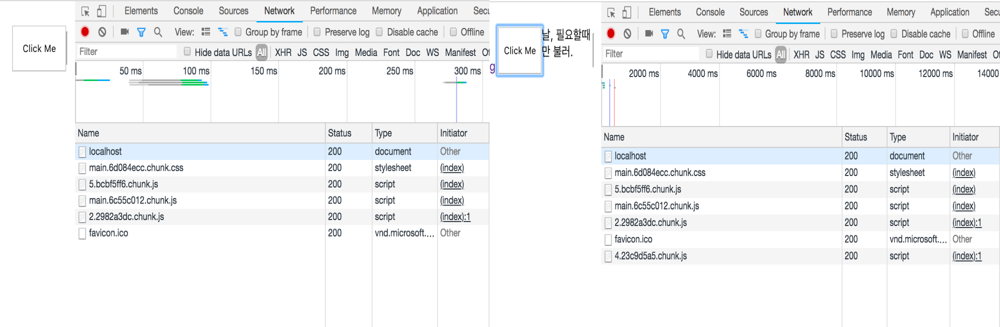
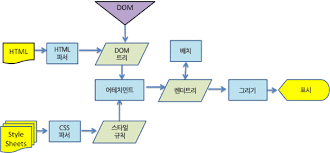
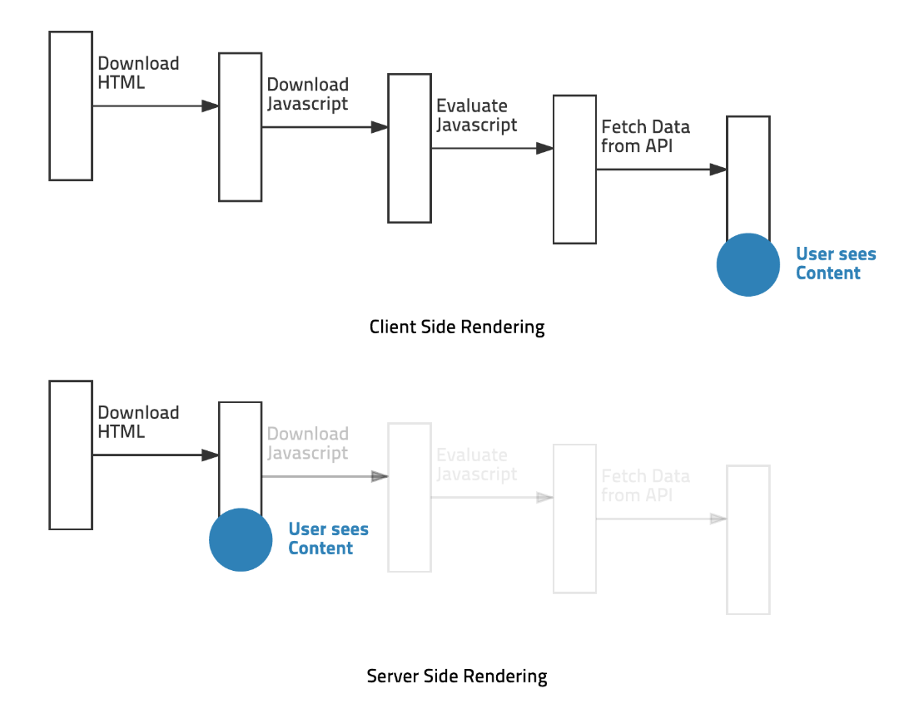
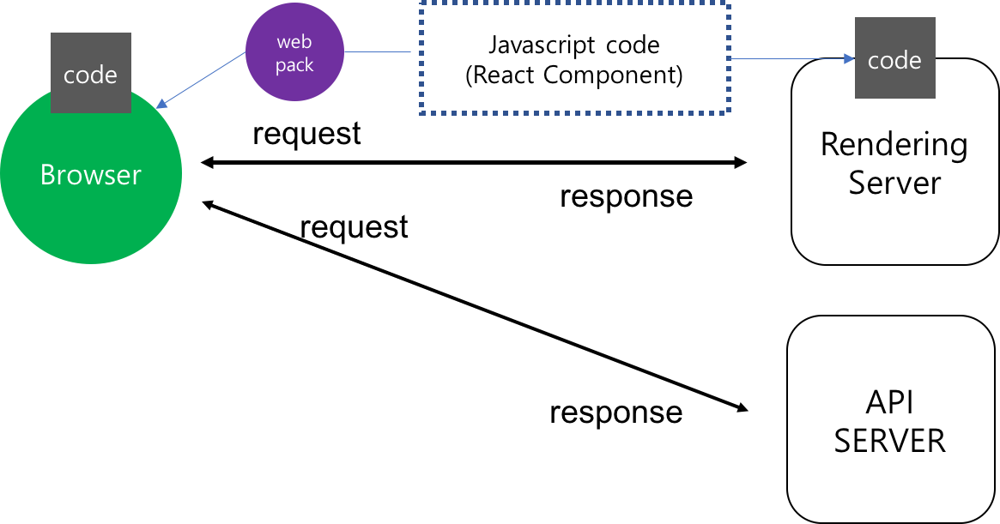

### Code Splitting

> #### Code Splitting 이란?

당장 쓰지 않는 코드들을 분리시켜두고 필요한 상황에 불러와 랜더링을 하는 방식을 말한다.

```javascript
import item from './components/Item'

class Menu extends Component {
state = {
  flag: false
}

itemhandler = () => {
  this.setState({
    flag: true
  })
}
  render() {
    const { flag } = this.state
    return (
    	<Fragment>
 				<Button onClick={this.itemhandler}> Show Button </Button>   	
	    	{ flag && <item /> }
    	</Fragment>
    )
  }
}
```

위의 코드를 예를들어 보자,  메뉴컴포넌트 childrend으로 item들이 있으며, Button이 클릭 된 후 flag state에 의해 디스플레이 여부를 판단한다. 일반적으로 초기 페이지를 랜더링할 때 모든 컴포넌트가 같이 랜더링 되므로 초기 로딩속도가 느려질 수 밖에 없는 구조이다. 평소에는 사용하지 않는 컴포넌트를 불러오지 않도록 분리시켜 놓고, 필요한 경우에 컴포넌트를 랜더링하여 불러오는 방식을 Code Splitting이라고 한다.


그럼 이제 코드를 수정해보잣-!

```javascript
import item from './components/Item'

class Menu extends Component {
state = {
  item: null,
}

itemhandler = () => {
  import('./item').then(({default : item})) => {
    this.setState({
      item
    })
  })
}
  render() {
    const { flag } = this.state
    return (
    	<Fragment>
 				<Button onClick={this.itemhandler}>Show Button</Button>
	    	{ item && <item /> }
    	</Fragment>
    )
  }
}
```

위 코드는 item state의 값 유무에 따라 컴포넌트의 디스플레이 여부를 판단한다.

null값을 가지는 item 객체를  state로 선언해두고 버튼 이벤트가 발생했을 때 동적으로 Component를 불러오며 불러온 컴포넌트를 통해 item의 state를 변경시켜주는 코드이다.

\* import 함수는 webpack에서 제공하는 함수이며, 비동기적으로 CommonJS 형태(default를 설정 하는 이유)로 컴포넌트를 불러온다.  import 함수를 이용하면 webpack에서 자동으로 chunk 형태로 번들링 해준다.

위와 같은 문법을 "dynamic import syntax" 라고 부른다.




Code Splitting을 하면 이렇게-! 이벤트가 발생했을 때 동적으로 4.23~~~.chunk.js 파일을 가져오는것을 확인 할 수 있습니다.


> ### 코드를 재활용 해보자! - HoC (Higher-order-component)

"쉽게말해 반복되는 코드를 재활용하자!"가 목표입니다. 코드를 작성하다 보면 수많은 컴포넌트들이 생기게되고 이 무수히 많은 컴포넌트들을 하나하나 스플릿팅 해야 한다고 생각해봅시다. 스플릿팅이 필요할 때 마다 하나하나 state를 만들어가면 작업하기에는 너무 귀찮ㅡ,.ㅡ ..

그래서 반복되는 코드를 재활용 하기 위해 리액트에서 사용하는 코드 패턴입니다.

Hoc 함수를 통해 특정 컴포넌트에게 반복되는 기능을 입혀주는 역할을 합니다


위의 코드를 바탕으로 컴포넌트를 스플릿팅할 때 반복되는 코드는 다음과 같습니다.

```javascript
// 1번!
state = {
  Component,
}

// 2번!
import('./item').then(({default : item})) => {
  this.setState({
    item
  })
})

// 3번!
{ Component && <Component />}
```

해당 코드를 매번 스플릿팅할 컴포넌트마다 작성해주는 것은 어지간히 비효율적인 일 입니다.  이런 반복적인 일을 해결해주는게 Hoc 패턴이죠! 음... 모듈화(?)라고 생각하시면 편할 것 같습니다.


Hoc의 기본 틀은 다음과 같습니다.

```javascript
import React, { Component } from 'react';

const withSplitting = getComponent => {
  class WithSplitting extends Component {
    state = { 
      Splitted: null,
    }
  
    constructor(props) {
      super(props)
      getComponent().then(({default: Splitted}) => {
        this.setState({
          Splitted
        });
      });
    }

    render() {
      const {Splitted} = this.state
      if (!Splitted) {
        return null;
      }
      return <Splitted {...this.props} />
    }
  }
  return WithSplitting
}

export default withSplitting
```

우선, Hoc의 네이밍은 "with_________" 의 규칙을 따르게 됩니다.

withSplitting 함수는 getComponent를 인자로 받아옵니다. 이 getComponent의 정체는 위에서 말했던 "dynamic import syntax"를 말합니다. 네이밍 그대로 컴포넌트를 가져오는 함수인 ()=>import('.files')이 들어가게 되죠! getComponent를 통해 비동기적으로 컴포넌트를 불러오고 state에 넣어줍니다. 그 다음은 state를 불러와 랜더링 해주는 로직이 진행되죠.

최종적으로는 하나의 클래스를 가진 함수를 반환해주는 구조입니다. 그리고 클래스 안에서는 컴포넌트를 랜더링하는 과정이 이루어지게 되구요.


그렇다면 위의 코드를 한번 더 수정해 봅시다.

```javascript
const item = withSplitting(() => import('./Item'))

class Menu extends Component {
state = {
  flag: false,
}

itemhandler = () => {
    this.setState({
      flag: true
    })
}
  render() {
    const { flag } = this.state
    return (
    	<Fragment>
 				<Button onClick={this.itemhandler}>Show Button</Button>
	    	{ flag && <item/> }
    	</Fragment>
    )
  }
}
```

코드를 이렇게 수정하면  Hoc를 이용한 코드 스플릿팅까지 완성됩니다.


### SSR(Server Side Rendering)

> ##### SSR(Server Side Rendering)이란?


말그대로 서버에서 미리 랜더링을 진행하여  HTML 파일을 생성한 후 브라우저에 전달하는 방법을 말합니다.





위의 그림은 파일들이 랜더링 되고 사용자 화면에 나타나기 까지의 과정을 나타냅니다.

클라이언트 사이드에서 랜더링이 진행되면 위의 모든 과정을  클라이언트에서 진행하기 때문에 초기 페이지 로딩속도가 현저하게 떨어집니다.



위의 그림은 서버사이들 랜더링과 클라이언트 사이드 랜더링의 차이점 입니다.


### 장점1. 초기 페이지 로딩속도 향상

서버 사이드 랜더링은 리액트 컴포넌트를 html로 변환한후 클라이언트로 response 해주고 클라이언트에서 나머지 부분을 추가하여 렌더링 합니다.

CSR의 경우 사용자가 페이지에 대한 요청을 보내고 실제 유저가 볼수 있는 화면이 되기까지 여러 과정을 거쳐야 해요.

SPA에서는 HTML을 가져오는 역할을 javascript에서 수행하는 Client Side에서 진행합니다.

CSR을 사용하게 되면 Client에서 HTML을 다운받고 javascript files를 다운 받은후 API로 부터 데이터를 받아 바인딩 한 후 실제 사용자가 볼 수 있는 화면이 되요

하지만 코드 양의 증가로 인해 클라이언트는 점점 무거워지기 시작했고, 클라이언트에서 HTML의 랜더링 뿐만 아니라 다른 작업들 까지 진행하게 되면서 초기 랜더링 속도가 느려지게 됐고 이런 이유 때문에 서버에서 초기 페이지 랜더링을 담당하는 SSR을 SPA에서도 도입하기 시작했어요.


### 장점2. SEO 최적화

클라이언트 측에서 랜더링을 할 경우 검색엔진은 자바스크립트를 구동할 준비가 안되어 있기 때문에 정상적인 페이지를 수집하지 못합니다. 그렇기 때문에 검색 엔진에서 우리가 만든 페이지를 제대로 수집할 수 없게 되죠. 다만, 구글 검색엔진의 경우 검색엔진 자체에서 자바스크립트를 구동하여 수집하지만,  자바스크립트 엔진을 구동하기 까지 어느정도의 조건이 필요하다고 합니다. 

하지만 서버 사이드에서 랜더링이 진행된다면, 읽어들인 React Component를  HTML로 변환 후  사용자에 보여주기 때문에 SEO에 좀 더 최적화된 노출을 할 수 있습니다.


### 단점1. 번거롭다... 메~~~우

서버에서 React Compoent를 불러다 RenderToString 해주는 과정을 갖추어야 한다.  고로, React의 JSX문법을 빌드하는 환경을 만들어 주어야하며, javascript 문법차이를 webpack의 babel-loader를 통해 변환하는 과정이 필요하다. (문법을 변환하는 과정은 굳이 webpack을 이용하지 않아도 된다)


### 단점2. 서버의 부하가 증가한다

클라이언트에서 해야하는 작업을 약간은 서버한테 미리 시키는 상황이 발생하기 때문에, 서버에서는 기존의 클라이언트 사이드 랜더링 보다 더 많은 부하가 발생하게 된다. 서버의 성능이 낮은 경우 폭죽놀이를 경험할 수 있다. 터져라 뻥! 뻥!

이런 문제를 해결하기 위해 우리 서비스에서는 아래와 같은 구조를 이용한다.




별거없다. 랜더링 서버랑  API서버를 분리해서 이용한다. 끝.


> ### 이제 SSR을 직접 해보자!

서버 사이드 랜더링을 진행하기 위해서는 클라이언트에서 준비한 컴포넌트 코드를 Node.js에서 사용해야 합니다. 저희는 react에서 JSX와 es6의 문법을 사용하기 때문에 Node.js에서 사용할 수 있는 문법으로 변환해주기 위해 babel을 사용해야 하지만 webpack에 있는 babel-loader를 통해 코드를 변환하고 파일을 만들어 보도록 하겠습니다!


##### 우리가 해야 할 일의 순서는 다음과 같습니다.

1. 코드를 랜더링 해줄 서버를 제작합니다.
2. 서버에서 react component의 JSX를 HTML 문자열로 변환하여 줍니다.
3. HTML  문자열로 변환된 데이터를 webpack을 통해 번들링 해줍니다.
4. 브라우저에서 해당  url로 요청이 들어오면 위의 과정을 통해 response 할 수 있도록 경로를 잡아준다.


참고한 예제에서 kao.js로 예제를 만들어 놓았기 때문에 저도 koa로 따라했는데, express랑 다를게 크게 없기 때문에 그냥 따라하셔도 되고, express로 해도 상관 없을듯 합니다. 거의 똑같으니 그냥 따라해보는 것도 나쁘지 않을 것 같습니다.

```shell
$ create-react-app react-ssr-tutorial
$ yarn eject
$ yarn install --save koa koa-static
```


서버에서 랜더링을 하려면 랜더링할 서버가 필요하겠쥬?

```javascript
// server/index.js 

const Koa = require('koa');
const serve = require('koa-static');
const path = require('path');
const app = new Koa();

// 정적 파일을 제공해주기 위한 코드
app.use(serve(path.resolve(__dirname, '../build/')));
app.use(ctx => {
  ctx.body = 'Hello World';
});
	
app.listen(3001);	
```

이제 서버를 열어 줍시다.

```
$ node server 
```

localhost:3001로 접근하면 뙇!!!!! 하고 서버가 열려있쥬? Hello World라는 글씨가 보이면 성공! 이제 랜더링을 해줄 서버를 만들었으니 본격적으로 진행 해 봅시다.


우선, 서버사이드 렌더링을 위해, 엔트리 파일을 다시 만들어 줍니다.

```javascript
// src/server/render.js

import React from 'react';
import { StaticRouter } from 'react-router';
import ReactDOMServer from 'react-dom/server';
import App from 'shared/App';

// 랜더링할 location을 인자로 받아 해당 경로에 맞는 코드를 renderToString 합니다.
const render = (location) => ReactDOMServer.renderToString(
    <StaticRouter location={location}>
	    <App/>
    </StaticRouter>
);

export default render;
```

ReactDOMServer.renderToString 함수를 통해 우리가 JSX를 HTML 문자열로 변환해 줍니다. 그리고 변환된  HTML 문자열을 webpack을 통해 번들링 하게 됩니다.


> ### 서버용 웹팩 환경설정

클라이언트에서 했던것과 마찬가지로 서버에서 사용할 webpeck.config.server.js 파일을 만들어주고 환경설정을 해주어야 합니다.

저는 웹팩을 처음 다루어 보기 때문에 이것저것 또 찾아 봤어요. 저처럼 웹팩에 대해 1도 모른다 하시는 분들만 봐주시고, 불필요시 JUMP! 해주세용. 


웹팩의 전체 틀은 다음과 같습니다.

웹팩 구성설명에 관련된 코드는 전부 샘플코드이니 혼동없길 바랍니다.

##### webpack.config.js

```javascript
const webpack = require('webpack');
module.exports = {
  mode: 'production',
  entry: {
    'resultFilename': '',
  },
  output: {
    path: '',
    filename: '',
    publicPath: '',
  },
  module: {
    
  },
  plugins: [],
  optimization: {},
  resolve: {
    moduels: ['node_modules'],
    extensions: ['.js','.json','.jsx','.css']
  }
}
```


###### 1. entry: 의존성 그래프의 시작점을 설정합니다.

```javascript
/*
엔트리로 설정된 두개의 파일이 하나의 app.js라는 결과물로 나온다.
a,b에 의존적으로 묶여진(import, require 관계로 묶여진) 다른 js 파일들까지 모두 합쳐주기 때문에 entry를 의존성 그래프의 시작점이라고 한다.
*/
entry: {
  app: ['a.js', 'b.js'],
  dongsu: ['c.js'],
}

```

###### 

###### 2. output: 번들링된 결과가 저장되는 곳 입니다.

```javascript
/*
나오는 결과물에 대한 설정을 하는 부분
*/
{
  output: {
    path: '/dist' // 어떤 경로에 저장될지 설정해 줍니다.
    filename: '[name].js' // [name]에는 entry에서 설정한 파일 이름이 들어갑니다.
    publicPath: '/' // 파일들이 위치할 서버상의 경로
  }
}
```


###### 3. loader: 파일들을 불러오는 역할을 합니다. 

###### 보통 webpack은 babel과 함께 사용합니다. 구형브라우저와 호환시키거나 jsx같은 리액트 문법을 컴파일 하기 위해 사용합니다.

\* babel을 사용하기 위해서는 babel-loader와 babel-core를 함께 설치해야 합니다.

\*  bable-loader는 webpack이 .js파일에 대해 babel을 실행하도록 만듭니다.

\*  babel-core는 실제로 babel이 작동하는데 필요한 코드입니다.

\*  babel-preset-env는 babel이 지원되는 범위를 설정합니다. env는 브라우저에 필요한 ecmascript 버전을 자동으로 파악해서 ployfill을 설치합니다. 

```javascript
/*
env에 있는 modules를 false로 설정해야 트리쉐이킹이 가능해집니다.
"트리쉐이킹이랑 import되지 않은 export들을 정리해주는 기능"입니다.
하지만 commonJS나 AMD, UMD 같은 모듈 시스템을 사용하는 클라이언트에서는 제대로 작동하지 않습니다.

exclude는 바벨로 컴파일 하지 않을 것들을 지정해 줍니다.
반대로 include는 반드시 컴파일 할 것들을 지정할 수 있습니다.
*/
{
  module: {
    rules: [{
      test: /\.jsx?$/,
      loader: 'babel-loader',
      options: {
        presets: [
          '@babel/preset-env', {
            targets: { node: 'current'},
            modules: 'false',
          }
        ],
        '@babel/preset-react',
      },
      exclude: ['/node_modules'],
    }]
  }
}
```


###### 4. resolve:  webpack이 알아서 경로나 확장자를 처리할 수 있게 도와주는 옵션입니다. 

```javascript
/*
modules에 node_modules를 넣어야 디렉토리의 node_modules를 인식한다. extension에 넣은 확장자들을 알아서 처리해 주기 때문에 파일에 확장자를 넣을 필요가 없다.
*/
resolve: {
    moduels: ['node_modules'],
    extensions: ['.js','.json','.jsx','.css']
  }
```


###### 5. optimization : 웹팩4에서 최적화 플러그인들이 모두 optimization attribute로 통합되었습니다.

```javascript
/*
mode가 production인 경우 자동으로 minimize options과 splitChunk 옵션이 on 상태가 되니 잊지 말라구욧-!
*/

{
  optimiation: {
    minimize: true/false, // UglyfyJsPlugin 합류!
    splitChunk: {}, // CommonChunkPlugin 계승!
    concatenateModules: true // ModuleConcatenateionPlugin 계승
  }
}
```


> #### 이제 진짜로 SSR을 위한 webpack 설정을 해보자!

webpack.config.js에서 사용할 경로를 설정해주자.

###### config/paths.js

```javascript
(...)
module.exports = {
	(...)
  serverRenderJs: resolveApp('src/server/index.js'), // 엔트리경로,
  server: resolveApp('server/render'), // 번들파일 저장경로,
};
```


필요한 패키지와 플러그인들을 require 해주고 위에서 살펴본 각종 속성들을 설정해준다.

##### config/webpack.config.server.js 

```javascript
// config/webpack.config.server.js 웹팩 환경두 잡아쥬규~~

'use strict';

const path = require('path');
const webpack = require('webpack');
const CaseSensitivePathsPlugin = require('case-sensitive-paths-webpack-plugin');
const WatchMissingNodeModulesPlugin = require('react-dev-utils/WatchMissingNodeModulesPlugin');
const getClientEnvironment = require('./env');
const paths = require('./paths');


const publicUrl = '';
const env = getClientEnvironment(publicUrl);

module.exports = {
  entry: paths.serverRenderJs,
  // Node.js 내장 모듈과 충돌이 일어나지 않으며 require 로 불러올 수 있는 형태로 번들링합니다
  target: 'node', // 대상을 node 한정 합니다.
  output: {
    // 정해준 서버 경로에 render.js 라는 파일명으로 저장합니다
    path: paths.server,
    filename: 'render.js',
    libraryTarget: 'commonjs2' // node 에서 불러올 수 있도록, commonjs2 스타일로 번들링 합니다
  },
  resolve: {
    modules: ['node_modules', paths.appNodeModules].concat(
      process.env.NODE_PATH.split(path.delimiter).filter(Boolean)
    ),
    extensions: ['.js', '.json', '.jsx'],
  },
  module: {
    strictExportPresence: true,
    rules: [
        // 자바스크립트 이외의 파일들을 무시합니다.
        {
            exclude: [
                /\.(js|jsx)$/,
                /\.json$/
            ],
          // ignore-loader를 사용하기 위해선 yarn add 읍읍.. 아시죠?
            loader: 'ignore-loader',
        },
      // 자바스크립트는 Babel 을 통하여 트랜스파일링합니다
      {
        test: /\.(js|jsx)$/,
        include: paths.appSrc,
        loader: require.resolve('babel-loader'),
        options: {
          cacheDirectory: true,
        },
      }
    ],
  },
  plugins: [
    // 필수 플러그인만 넣어줍니다
    new webpack.DefinePlugin(env.stringified),
    new CaseSensitivePathsPlugin(),
    new WatchMissingNodeModulesPlugin(paths.appNodeModules),
  ]
};
```


build시에 사용할 서버용 스크립트 파일을 생성해준다.

##### scripts/build.server.js

```javascript
'use strict';

process.env.BABEL_ENV = 'production';
process.env.NODE_ENV = 'production';

/* 나중에 클라이언트쪽 코드에서 process.env.APP_ENV 값을 통하여 
서버일때만, 혹은 브라우저일때만 특정한 작업을 하도록 설정 할 수 있습니다. */
process.env.APP_ENV = 'server'; 


process.on('unhandledRejection', err => {
  throw err;
});


require('../config/env');

const webpack = require('webpack');
const config = require('../config/webpack.config.server'); // 서버용 환경설정을 지정
const paths = require('../config/paths');
const checkRequiredFiles = require('react-dev-utils/checkRequiredFiles');
const formatWebpackMessages = require('react-dev-utils/formatWebpackMessages');

if (!checkRequiredFiles([paths.serverRenderJs])) {
  process.exit(1);
}

function build() {
  console.log('Creating an server production build...');

  let compiler = webpack(config);
  return new Promise((resolve, reject) => {
    compiler.run((err, stats) => {
      if (err) {
        return reject(err);
      }
      const messages = formatWebpackMessages(stats.toJson({}, true));
      if (messages.errors.length) {
        return reject(new Error(messages.errors.join('\n\n')));
      }
      return resolve({
        stats,
        warnings: messages.warnings,
      });
    });
  });
}

build();
```


그 다음엔, 웹팩에서 APP_ENV 를 인식 할 수 있도록, config/env.js 내의 getClientEnvironment 함수에서 다음과 같이 APP_ENV 값을 넣어주세요.

##### config/env.js

```javascript
function getClientEnvironment(publicUrl) {
  const raw = Object.keys(process.env)
    .filter(key => REACT_APP.test(key))
    .reduce(
      (env, key) => {
        env[key] = process.env[key];
        return env;
      },
      {
        NODE_ENV: process.env.NODE_ENV || 'development',
        PUBLIC_URL: publicUrl,
        // APP_ENV 추가
				/APP_ENV: process.env.APP_ENV || 'browser'/
      }
    );
    // (...)
```


쉬운 명령어 사용을 위해 명령어도 셋팅해줍니다.

##### package.json

```javascript
// package.json

"scripts": {
    "start": "cross-env NODE_PATH=src node scripts/start.js",
    "start:server": "node server",
    "build": "cross-env NODE_PATH=src node scripts/build.js",
    "build:server": "cross-env NODE_PATH=src node scripts/build.server.js",
    "test": "node scripts/test.js --env=jsdom"
  },
```


```shell
$ yarn build:server
```

render.js 라는 번들링 파일이 제대로 생성 되었다면 webpack설정은 완뇨!!!!


> ### 서버사이드 렌더링 미들웨어 작성 

브라우저로 부터 요청이 들어왔을때 해당 경로에 따라 서버에서 redering을 진행할 수 있도록 미들웨어를 작성해 줍니다. 아래의 코드는 '/'의 경로로 요청이 들어왔을때 서버 사이드 랜더링이 발생하도록 작성해준 코드입니다.

##### server/render/index.js

```javascript
const Koa = require('koa');
const serve = require('koa-static');
const path = require('path');

const app = new Koa();

const render = require('./render')

app.use((ctx, next) => {
  // 경로가 일치하면 랜더링 작업을 시작합니다.
  if(ctx.path === '/') return render(ctx);
  return next();
})

app.use(serve(path.resolve(__dirname, '../build/')));
// 요청받은 경로가 파일들이 아니라면, 해당 경로를 위한 서버사이드 렌더링을 해줍니다
app.use(render);

app.listen(3003);
```

위의 작업을 진행하면 1차적인 서버사이드 랜더링이 완료 됩니다. 서버쪽 코드를 보시면 알겠지만 비동기처리가 하나도 되어있지 않기 때문에 한번에 하나의 요청에 대해서 밖에 처리해주질 못합니다.  리덕스를 연동하면서 비동기로 서버 사이드 렌더링을 진행할 수 있도록 코드를 수정해 보도록 하겠습니다.


> #### 리덕스, 리덕스, 리덕스를 연동하자.

리덕스를 설치해 줍니다.

```shell
$ yarn add redux react-redux redux-actions redux-pender axios
```


간단하게 api 요청을 위해 사용할 api.js 파일을 생성합니다.

##### src/lib/api.js

```javascript
import axios from 'axios';

export const getUsers = () => axios.get('https://jsonplaceholder.typicode.com/users');
```


리덕스를 이용하기 위해 위에서 발생한 api를 통해 받아요는 사용자 정보를 가공해줄 모듈 파일을 생성해줍니다.

##### src/redux/moduels/users.js

```javascript
import { createAction, handleActions } from 'redux-actions';
import { pender } from 'redux-pender';

import * as api from 'lib/api';

// 액션 타입
const GET_USERS = 'users/GET_USERS';

// 액션 생성자
export const getUsers = createAction(GET_USERS, api.getUsers);

// 초기 상태
const initialState = {
    data: []
};

export default handleActions({
    ...pender({
        type: GET_USERS, 
        onSuccess: (state, action) => {
            return {
                data: action.payload.data
            }
        }
    })
}, initialState);
```


redux-pender를 이용해, penderReducer와 users의 reducer를 combine합니다.

##### src/redux/modules/index.js

```javascript
import { combineReducers } from 'redux';
import users from './users';
import { penderReducer } from 'redux-pender';

export default combineReducers({
    users,
    pender: penderReducer
});
```


우리는 서버 사이드에서 우선적으로 이루어지는 통신에 대한 결과값을 store를 통해 넘겨받을 예정입니다. 즉 서버쪽에서도 store를 생성할 수 있도록 함수를 따로 분리시키도록 하겠습니다.

##### src/redux/configureStore.js

```javascript
import { createStore, applyMiddleware, compose } from 'redux'
import penderMiddleware from 'redux-pender';

import modules from './modules';

const isDevelopment = process.env.NODE_ENV === 'development'; // 환경이 개발모드인지 확인합니다

// 개발모드에서만 리덕스 개발자도구 적용
const composeEnhancers = isDevelopment ? (window.__REDUX_DEVTOOLS_EXTENSION_COMPOSE__ || compose) : compose;

const configureStore = (initialState) => {
    const store = createStore(modules, initialState, composeEnhancers(
        applyMiddleware(penderMiddleware())
    ));

    // hot-reloading 를 위한 코드
    if(module.hot) {
        module.hot.accept('./modules', () => {
            const nextRootReducer = require('./modules').default;
            store.replaceReducer(nextRootReducer);
        });
    }

    return store;
}

export default configureStore;
```


##### redux/store.js

```javascript
import configureStore from './configureStore';

// 클라이언트에서만 사용됨
export default configureStore();
```


이제 리덕스를 생성하고 필요한 파일들(액션, 액션생성자, 리듀서)를 전부 생성해 주었으니 리덕스를 사용할 수 있도록 연동하는 작업을 시작 하겠습니다. 앞서 진행했던 "redux 사용하기"에서와 마찬가지로 진행됩니다.

```javascript
import React from 'react';
import { BrowserRouter } from 'react-router-dom';
import App from 'shared/App';
import store from 'redux/store';
import { Provider } from 'react-redux';

const Root = () => (
    <BrowserRouter>
        <Provider store={store}>
            <App/>
        </Provider>
    </BrowserRouter>
);

export default Root;
```


통신을 통해 받아온 데이터에 대해 데이터가 바인딩 되는 과정을 알아보도록 하겠습니다.

우선적으로 데이터를 로딩할때, componentWillMount에서 작업을 호출하게 됩니다. 이유는 서버와 클라이언트에서 모두 통신이 이루어지기 때문에, componentDidMount를 이용하지 않습니다. 하지만 현재 v16.3 이후로 deprecated 되었기 때문에 저는 contructor 내부에서 작업을 수행 할 수 있도록 변경시켜 주었습니다.  그리고 react-router-server에서 제공된  withDone 함수를 통해 동기처리를 해 주었습니다.

서버에서 통신과 렌더링이 되는 과정은 다음과 같습니다.

contructor 실행 → 데이터로딩 → done 함수가 호출 될 때까지 렌더링을 지연시킴 → done 이 호출됨 → render 실행

클라이언트에서는 렌더링이 지연되지 않습니다:

contructor 실행 → 데이터 로딩 → 데이터 로딩중에 render 됨 → 값이 업데이트됨 → 다시 render 하여 업데이트

서버 사이드에서 통신이 이루어지고 렌더링되도 클라이언트에서는 컴포넌트 라이프 사이클을 똑같이 지키며 실행됩니다. 그렇기 때문에 서버에서 받아온 데이터의 유무에 따라 중복 요청을 방지하기 위한 로직을 추가로 작성하였습니다.

또한,  bindActionCreator를 통해 Action을 하나하나 바인딩 하지 않고 한꺼번에 바인딩 하엿습니다.

라우터 설정에 관한 부분은 앞에서 다루었으니 첨부된 코드를 통해 확인해주시고 따로 다루지 않겠습니다.

##### src/pages/Users.js

```javascript
import React, { Component } from 'react';
import { connect } from 'react-redux';
import { bindActionCreators } from 'redux';
import * as usersActions from 'redux/modules/users';
import { withDone } from 'react-router-server'; 

class Users extends Component {
    constructor(props) {
      const { UsersActions, data, done } = props;
      if(data.length !== 0) return false; // 데이터가 이미 존재하면 재요청 하지 않음
      UsersActions.getUsers().then(done, done); // Promise 가 성공했을때, 혹은 실패했을때 done() 호출
    }

    render() {
        const { data } = this.props;

        // 유저 이름 목록을 생성합니다
        const userList = data.map(
            user => <li key={user.id}>{user.name}</li>
        );

        return (
            <div>
                <ul>
                    {userList}
                </ul> 
            </div>
        );
    }
}

// withDone 으로 감싸주면, done 이 호출될때까지 렌더링을 미룹니다
export default withDone(connect(
    (state) => ({
        data: state.users.data
    }),
    (dispatch) => ({
        UsersActions: bindActionCreators(usersActions, dispatch)
    })
)(Users));
```


앞에서 말헀던 렌더링을 비동기적으로 구동되게 하기 위해 react-router-server의 renderToString 함수를 사용합니다. 기존의 ReactDOMServer.renderToString은 지워줍니다.

##### src/server/render.js

```javascript
import React from 'react';
import { StaticRouter } from 'react-router';
import App from 'shared/App';
import configureStore from 'redux/configureStore';
import { Provider } from 'react-redux';

/*
  기존에 사용하던 ReactDOMServer.renderToString은 지워 줍니다. <- 동기적으로 작동
  react-router-server 의 renderToString 은 비동기로 작동하며,
  데이터 로딩도 관리해줍니다.
*/

import { renderToString } from 'react-router-server';

const render = async (location) => {
    // 서버사이드에선, 매 요청마다 새 store 를 생성해주어야 합니다.
    const store = configureStore();

    const { html } = await renderToString(
        <StaticRouter location={location}>
            <Provider store={store}>
                <App/>
            </Provider>
        </StaticRouter>
    );

    // 스토어와, 렌더링된 문자열 결과물을 반환합니다
    return {
        html,
        state: store.getState()
    };
}

export default render;
```


위 코드의 결과값으로 toString된 Html과 state를 넘겨 받았으니 서버쪽 코드도 변경해 줍니다. render 함수의 결과물로 받은 state는 window.______PRELOAD_STATE__ 변수에 문자열로 변환하여 넣어줍니다.

##### server/render/index.js

```javascript
const fs = require('fs');
const path = require('path');
const render = require('./render').default; // ES6 형식으로 만들어진 모듈이므로, 뒤에 .default 를 붙여주어야합니다.

// html 내용을 해당 상수에 저장합니다
const template = fs.readFileSync(path.join(__dirname, '../../build/index.html'), { encoding: 'utf8'});

module.exports = async (ctx) => {
  const location = ctx.path;
  const { html, state } = await render(location);

  const page = template.replace(
    '<div id="root"></div>',
    `<div id="root">${html}</div><script>window.__PRELOADED_STATE__=${JSON.stringify(state)}</script>`);
  ctx.body = page; 
}
```


이제 서버에서 초기 state값을 넘겨주었으니,  src/redux/store.js의 configureStore의 인자로 window.\_\_PRELOAD_STATE__를 넣어줍니다.

##### src/redux/store.js

```javascript
import configureStore from './configureStore';

// 클라이언트에서만 사용됨
export default configureStore(window.__PRELOADED_STATE__);
```


[이거보고](https://velopert.com/3425) 따라하는게 정신건강에 더 좋습니다. 근데 양이 좀 많을 수도 있어요. 해당 링크의 예지를 따라하기 위해서는 앞쪽에 포스팅된 1.React-Router 2. Code-Splitting 예제를 모두 진행한 후 3.Server-Side-Rendering 예제를 진행해주시면 되고, 제가 첨부해드린 파일은 React-router, code-splitting, ssr을 모두 포함하는 예제입니다.


이렇게 제가 준비한 ServerSideRendering에 관련된 자료는 끝이났습니다!

정규 스터디 시간에 준비한 자료가 너무 미흡하여 폭풍창피했고 너무 죄송스러워 열심히 다시 만들었습니다 ㅜㅡㅠ. 다시 한번 사과의 말 전하고 싶네요!!


